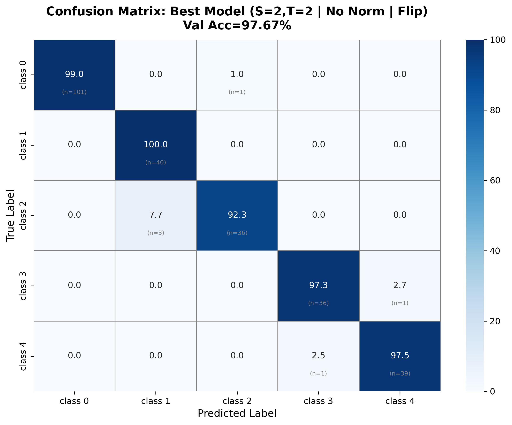
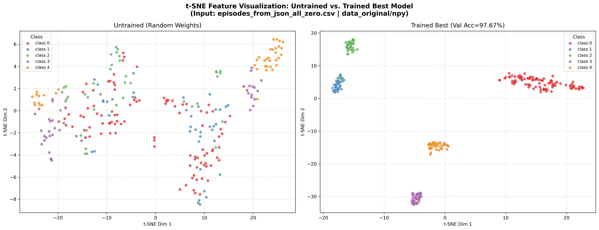
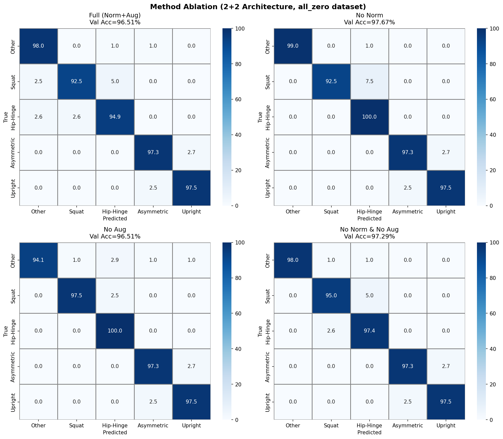
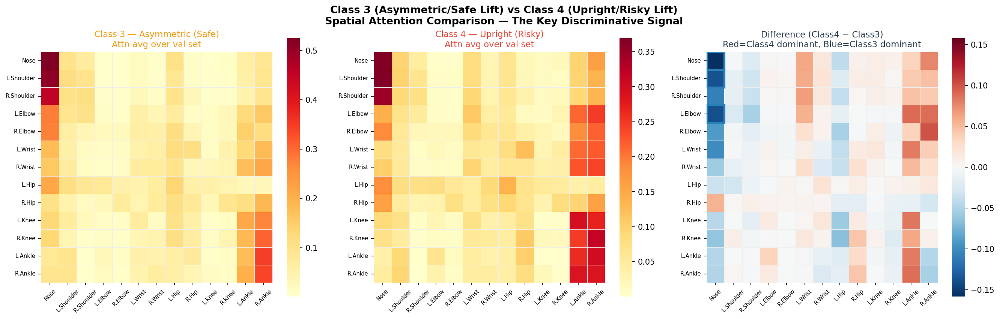
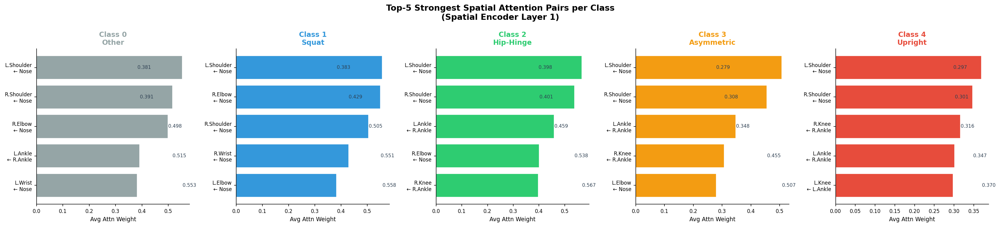
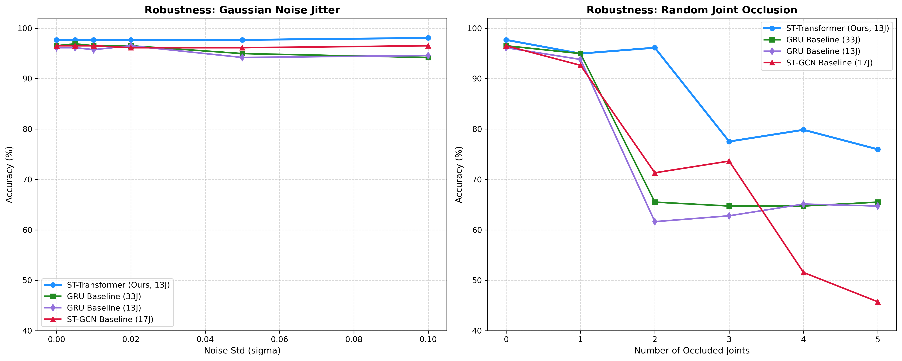
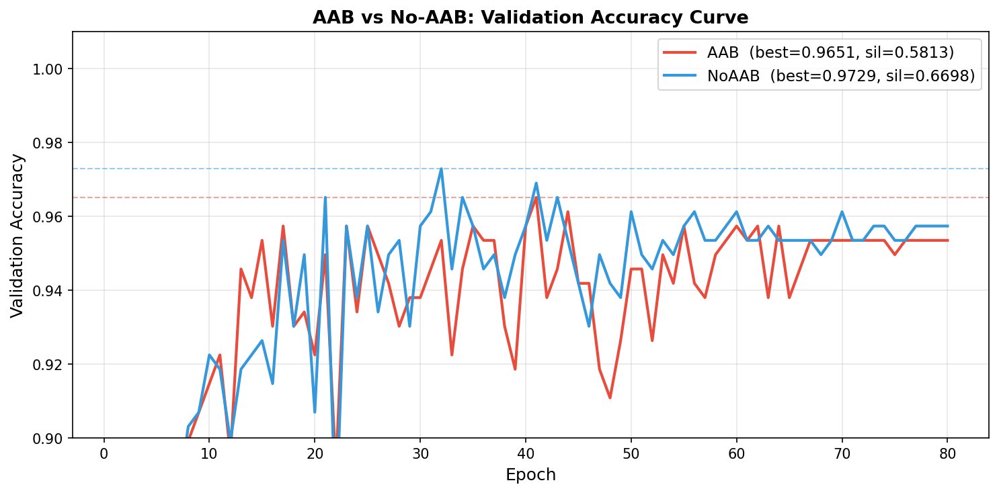
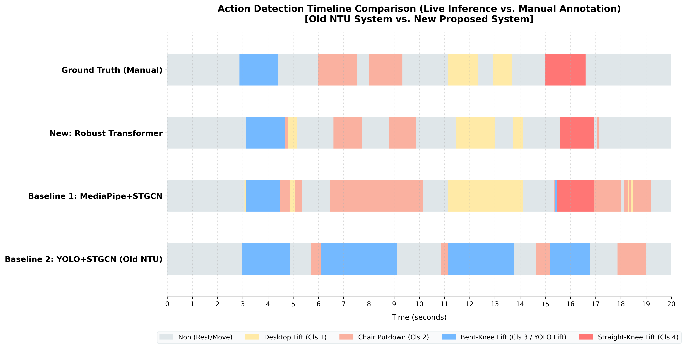
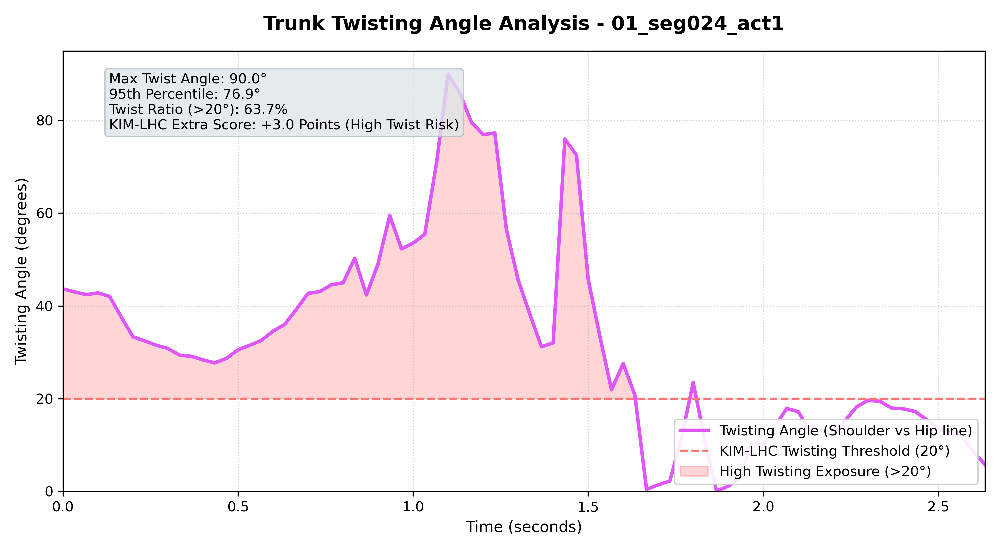

# Real-Time Lower Back Injury Risk Monitoring System

**Master's Thesis — National Taiwan University, June 2026**

A contactless, real-time system for detecting lower back injury risk during manual material handling (MMH), using 3D skeleton extraction and a Spatio-Temporal Transformer. Compatible with standard IP cameras via RTSP streaming. Compliant with Taiwan's Occupational Safety and Health Act and KIM-LHC ergonomic assessment standards.

---

## Key Results

| Metric | Value |
|:-------|:-----:|
| 5-class validation accuracy | **97.67%** |
| Feature space Silhouette Score | **0.7339** |
| Background (Class 0) Specificity | **100%** |
| End-to-end FPS (CPU only, no GPU) | **85.3 FPS** |
| Model parameters / size | **4.08M / 15.57 MB** |
| Robustness under Gaussian noise σ=0.1 | **98.06%** |
| Robustness under 2-joint occlusion | **96.12%** |

---

## System Pipeline

```
RTSP Camera Stream
      │
      ▼
MediaPipe Pose  (5.98 ms/frame)
   33 joints → 13 core joints
      │
      ▼
Spatio-Temporal Transformer  (5.71 ms/inference)
   S=2 Spatial Layers + T=2 Temporal Layers
   No CS-Normalization  ← preserves absolute height features
      │
      ├─► 5-class action recognition
      ├─► Trunk twisting angle (shoulder-hip projection, ≥20°)
      └─► Dual-layer state machine + EMA smoothing
              │
              ▼
        SQLite event log + real-time GUI alert
```

**5 Action Classes (KIM-LHC aligned):**

| Class | Name | Risk Level |
|:-----:|:-----|:----------:|
| 0 | Other (background activity) | — |
| 1 | Squat lift (table height) | Low |
| 2 | Hip-Hinge (chair height) | Medium |
| 3 | Asymmetric lift (bent-knee) | Medium |
| 4 | **Upright bend (straight-knee)** | **High ⚠️** |

---

## Classification Performance

**Best model confusion matrix (S=2, T=2 | No-Norm | Fair-Flip | Val Acc = 97.67%):**



- Class 0 (background): **99% Recall** — near-zero false alarm rate
- Class 1 (Squat): **100% Recall**
- Class 3 vs Class 4 (safe vs. dangerous): correctly distinguished

---

## Feature Space Quality (t-SNE)

Untrained model (random weights) vs. trained ST-Transformer:



Silhouette Score improves from **-0.0057 → 0.7339**, demonstrating clear cluster boundaries for all 5 action classes.

---

## Core Contribution: No-CS-Normalization Strategy

Traditional skeleton action recognition applies Center-Scale Normalization (CS-Norm) to remove camera-position variance. We found that CS-Norm **destroys the absolute height features** critical for distinguishing background movements (Class 0) from lifting actions.

**Ablation study — effect of normalization and augmentation:**



| Method | Val Acc | Silhouette | Class 0 Recall |
|:-------|:-------:|:----------:|:--------------:|
| With CS-Norm + Augmentation | 96.51% | — | 0.98 |
| No Augmentation | 96.51% | — | 0.98 |
| **No Norm + Augmentation (Ours)** | **97.67%** | **0.7339** | **1.00** |

Compensation: online random rotation + offline Fair-Flip augmentation (1,124 → 2,506 training samples).

---

## Spatial Attention Interpretability

Our model **autonomously discovers biomechanically meaningful joint interaction patterns** without any anatomical supervision:



- **Class 4 (dangerous straight-knee bend)** → high **Knee ↔ Ankle** attention — directly corresponds to the KIM-LHC "knees straight while bending" high-risk indicator
- **Class 3 (safe asymmetric lift)** → high **Shoulder ← Nose** attention — captures trunk rotation and asymmetric posture

**Top-5 strongest spatial attention pairs per class:**



---

## Robustness Analysis

The model maintains high accuracy under real-world perturbations:



| Perturbation | ST-Transformer (Ours) | GRU-33J | ST-GCN |
|:------------|:---------------------:|:-------:|:------:|
| No noise | **97.67%** | 96.51% | 96.51% |
| Gaussian noise σ=0.1 | **98.06%** | 94.19% | 96.51% |
| 2 joints occluded | **96.12%** | 65.50% | 71.32% |
| 5 joints occluded | **75.97%** | 65.50% | 45.74% |

Self-attention's global weighting compensates for missing joints, while ST-GCN's fixed graph topology causes cascading accuracy collapse.

---

## Anatomical Attention Bias (AAB) Ablation

We investigated whether injecting anatomical graph-distance priors (AAB) into the spatial attention would help. Result: it **hurts** performance.



| Config | Val Acc | Silhouette | Class 0 Recall |
|:-------|:-------:|:----------:|:--------------:|
| + AAB (anatomical prior) | 96.51% | 0.5813 | 0.98 |
| **No AAB (Ours)** | **97.67%** | **0.7339** | **1.00** |

The anatomical bias interferes with the absolute position features preserved by No-Norm, validating that unconstrained self-attention discovers optimal patterns beyond anatomical topology.

---

## Live Action Detection Timeline

Continuous event detection compared against manual annotation ground truth:



All 6 lifting events are correctly segmented with **zero prediction flicker**, using the dual-layer state machine with EMA smoothing.

---

## Trunk Twisting Detection

KIM-LHC identifies trunk rotation ≥20° as a high-risk factor. The system computes the horizontal projection angle between shoulder and hip vectors in 3D:



---

## Comparison with Baselines

| Model | Joints | Dims | Val Acc | Silhouette | Inference |
|:------|:------:|:----:|:-------:|:----------:|:---------:|
| GRU Baseline (33J) | 33 | 6D | 96.51% | 0.4219 | 8.14ms |
| GRU Baseline (13J) | 13 | 3D | 96.12% | 0.4838 | 8.22ms |
| ST-GCN Baseline (17J) | 17 | 3D | 96.51% | 0.4634 | 6.79ms |
| **ST-Transformer (Ours)** | **13** | **3D** | **97.67%** | **0.7339** | **5.71ms** |

---

## Repository Structure

```
src/
├── models_transformer.py      # ST-Transformer (S=2, T=2, d_model=256)
├── models_transformer_aab.py  # Anatomical Attention Bias ablation variant
├── train_transformer.py       # EpisodePhaseDataset + training utilities
├── run_best_configs.py        # Best model training (No-Norm + Fair-Flip)
├── train_aab.py               # AAB ablation experiment
├── visualize_attention.py     # Spatial attention weight extraction & plots
├── extract_skeleton.py        # MediaPipe skeleton extraction to NPY
├── evaluate_robustness.py     # Gaussian noise + occlusion robustness tests
├── kim_scoring.py             # KIM-LHC risk score calculator
├── benchmark_fps.py           # End-to-end FPS benchmark
└── utils.py                   # Training utilities

thesis_materials/
├── deployment/
│   ├── live_cam_onnx_sqlite.py  # Production: ONNX inference + SQLite logging
│   └── export_to_onnx.py        # PyTorch → ONNX export
└── *.png                        # All experimental result figures

analysis/
└── *.csv                        # Ablation and evaluation result CSVs
```

---

## Quick Start

```bash
pip install torch mediapipe opencv-python numpy pandas scikit-learn matplotlib seaborn onnxruntime

# Real-time inference (RTSP stream, webcam, or video file)
python thesis_materials/deployment/live_cam_onnx_sqlite.py \
    --source 0 \
    --onnx_path path/to/model.onnx

# Visualize spatial attention weights from trained model
python src/visualize_attention.py

# Run AAB ablation (GPU recommended)
python src/train_aab.py

# Evaluate robustness under noise and occlusion
python src/evaluate_robustness.py
```

---

## Tech Stack

`PyTorch 2.x` · `MediaPipe` · `ONNX Runtime` · `OpenCV` · `SQLite` · `NumPy` · `scikit-learn` · `seaborn`

---

## Related Project

[**camera-isp-pipeline**](https://github.com/Yuan-Yuan52/camera-isp-pipeline) — A companion project implementing a full camera ISP pipeline from scratch (Demosaicing, White Balance, CLAHE), studying the effect of image preprocessing on skeleton detection quality in industrial lighting conditions.

---

## Author

**Ching-Yuan Yen (顏慶源)**  
Graduate Institute of Photonics & Optoelectronics, National Taiwan University  
Advisor: Prof. Hoang Yan Lin
